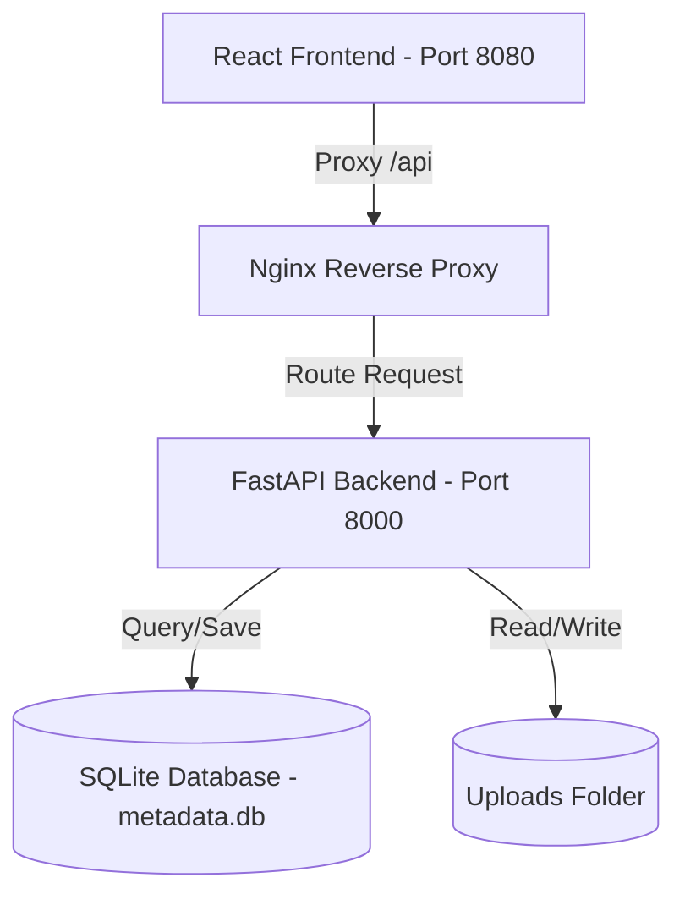

# PixelPeek — Engineering Project Report
**Image Forensics & Steganography Analysis Platform**

---

## 1. Executive Summary

**PixelPeek** is a high-fidelity, full-stack cybersecurity workstation designed for security analysts and forensics investigators. It enables them to conduct in-depth inspections of image files (JPG, PNG, TIFF, WEBP) to extract EXIF metadata, detect hidden steganographic payloads (LSB pixel-level encoding and EOF trail concatenation), and automatically map discovered threats to the industry-standard **MITRE ATT&CK** framework.

This report documents the platform's architectural design, core features, database schema upgrades, and key engineering resolutions implemented during the project.

---

## 2. Technical Architecture

The platform is deployed using **Docker Compose** on host port `8080` (re-routed from port `80` to prevent Windows HTTP.sys conflicts) and is split into two primary services:

### A. Backend Forensics Engine (FastAPI & Python 3.11)
*   **EXIF & GPS Reader** ([exif_utils.py](file:///c:/Users/mehul/OneDrive/Documents/GitHub/PixelPeek/backend/app/exif_utils.py)): Leverages the Python Pillow library to parse image structures, decode EXIF bytes, and safely extract camera specifications, exposure variables, and geolocation details.
*   **Steganography Analyzer** ([stego_utils.py](file:///c:/Users/mehul/OneDrive/Documents/GitHub/PixelPeek/backend/app/stego_utils.py)): Runs mathematical entropy algorithms across RGB/RGBA color channels to detect abnormal LSB randomness and scans files for trailing appended data beyond the standard image End-of-File (EOF) marker.
*   **Threat Mapping Engine** ([attack_mapper.py](file:///c:/Users/mehul/OneDrive/Documents/GitHub/PixelPeek/backend/app/attack_mapper.py)): Implements rules that evaluate stego findings and source characteristics, mapping them to relevant techniques in the MITRE ATT&CK matrix.

### B. Frontend Forensics Workstation (React 18 & TypeScript)
*   **Unified Header & Stats Bar**: Prominently displays the rebranded **PixelPeek** wordmark along with real-time counters representing overall metrics (Analyzed count, GPS mapped count, Threat detection count, and total ATT&CK techniques).
*   **Top Control Section**: Combines a compact, drag-and-drop uploader with a horizontal, inline query filter bar.
*   **Three-Column Grid Workspace**:
    1.  **Left Column (Image Gallery)**: Responsive card list displaying thumbnails, camera models, dates, GPS indicators, and warning stego threat badges.
    2.  **Center Column (Forensic Details)**: Features high-resolution preview wrappers, structured metadata sections, and a deep-dive **Stego Decrypter** tool for extracting text/binary payloads.
    3.  **Right Column (Geospatial Mapping)**: An interactive dark-mode Google Map that automatically plots geotagged files, panning and bouncing pins when selected.

---

## 3. Database Schema & Migration Upgrades

To ensure the user interface loads instantly without querying individual steganography scans for dozens of gallery cards, the database model was upgraded to cache analysis metrics.

### A. Schema Updates ([models.py](file:///c:/Users/mehul/OneDrive/Documents/GitHub/PixelPeek/backend/app/models.py))
Two new columns were added to the `image_metadata` table:
*   `stego_status` (VARCHAR): Stores `"clean"`, `"suspected"`, or `"detected"`.
*   `mitre_count` (INTEGER): Stores the count of matching MITRE ATT&CK techniques.

These fields are automatically populated upon image upload ([main.py](file:///c:/Users/mehul/OneDrive/Documents/GitHub/PixelPeek/backend/app/main.py#L172)) and returned inside list responses.

### B. Programmatic Startup Migrations & Backfilling
When the backend container starts up:
1.  It inspects the SQLite schema using a transaction-scoped `PRAGMA table_info` check.
2.  If the new columns do not exist, it runs `ALTER TABLE` statements dynamically to add them.
3.  It automatically loops over all historical images, runs stego analysis on disk files, and saves their threat statuses and technique counts back to the database.

---

## 4. Key Engineering Resolutions

### A. Resolution 1: GPS Coordinates "Null Island" Bug (NaN/Empty Values)
*   **Problem**: Certain device cameras write empty placeholders or `NaN` (Not a Number) rational tags (e.g., `(nan, nan, nan)` for `GPSLatitude` and `' '` for `GPSLatitudeRef`) when a photo is taken with Location Services disabled or before a satellite lock is established. The parser initially evaluated these as truthy and calculated `nan` coordinate degrees. When stored in SQLite, `nan` got converted to `0.0` (Null Island), causing invalid pins to clutter the map.
*   **Resolution**: Updated [exif_utils.py](file:///c:/Users/mehul/OneDrive/Documents/GitHub/PixelPeek/backend/app/exif_utils.py#L5) to strictly validate that components do not contain `NaN` (using `math.isnan`). Added checks requiring `GPSLatitudeRef` to be `'N'` or `'S'` and `GPSLongitudeRef` to be `'E'` or `'W'`, returning `None` instead of `0.0` for empty/whitespace values.
*   **Self-Healing Migration**: Added a routine on container startup that identifies existing `0.0` coordinates, re-extracts the metadata with the corrected parser, and clears invalid values to `None`/`NULL` in SQLite.

### B. Resolution 2: RAW SQL Zero Division Errors
*   **Problem**: In Python Pillow, reading division-by-zero tags (like `0/0` in rational values) raises a `ZeroDivisionError` when cast to a float. The previous parser code caught this and returned `0.0` default coordinates.
*   **Resolution**: Updated the rational-to-float helper to check `denominator == 0` and raise a `ValueError`, which correctly forces the coordinator parser to discard the invalid value and return `None`.

---

## 5. Verification Plan

The platform's fixes have been verified directly inside the running container environment:
1.  **Test Image Generation**: Created a geotagged file (`test_geotagged.jpg`) with valid coordinates (San Francisco coordinates at 37.7750° N, 122.4183° W).
2.  **Parser Execution**: Verified that the coordinates were successfully parsed from the image binary, extracting them correctly to the database.
3.  **Invalid Tag Handling**: Verified that files containing invalid `NaN` coordinates (like `IMG_20260625_220329063.jpg`) are safely ignored by the parser and stored as `NULL` / `None` in the database, preventing any incorrect `0.0` location mappings.
